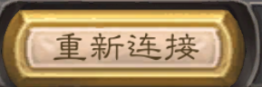

# 炉石重连助手

> 🎮 炉石传说酒馆战旗 —— 一键断网重连辅助工具

一个轻量级的 Windows 桌面悬浮窗工具，点击按钮即可通过防火墙规则实现《炉石传说》的断网与重连。在酒馆战旗模式中，可以利用断网重连跳过战斗动画，节省操作时间。

## ✨ 功能

- **悬浮窗**：无边框、始终置顶、可拖拽的桌面悬浮窗
- **一键断网重连**：自动通过防火墙规则断网，等待游戏掉线后恢复网络，自动识别并点击"重新连接"按钮
- **图像识别**：基于 OpenCV 模板匹配，自动定位重连按钮
- **安全兜底**：异常发生时自动恢复网络，防止游戏一直断网

## 📸 界面



- 标题栏：双击关闭窗口
- 一键断网重连：执行完整断网→重连流程
- 退出：关闭程序
- 状态栏：实时显示当前执行状态

## 🔧 技术栈

| 组件 | 用途 |
|------|------|
| tkinter | GUI 悬浮窗 |
| win32gui / win32con / win32process | Windows 窗口操作与进程信息 |
| OpenCV (cv2) + NumPy | 模板匹配图像识别 |
| pyautogui | 截屏与模拟鼠标点击 |
| netsh advfirewall | Windows 防火墙规则操作 |
| PyInstaller | 打包为独立可执行文件 |

## 📦 直接使用

从 [Releases]() 页面或 `dist/` 目录下载 `炉石重连助手.exe`，双击运行即可。

> ⚠️ **注意**：双击后会弹出 UAC（用户账户控制）窗口，必须点击"是"授权管理员权限，否则防火墙操作将失败。

## 🔨 从源码构建

### 环境要求

- Windows 10/11
- Python 3.10+
- 管理员权限（运行 exe 时需要）

### 安装依赖

```bash
pip install opencv-python numpy pyautogui pywin32 pyinstaller
```

### 打包为 exe

```bash
pyinstaller --noconfirm --onefile --windowed --uac-admin --name "炉石重连助手" --add-data "cljt.png;." reconnect_tool.py
```

打包完成后，exe 位于 `dist/炉石重连助手.exe`。

## 🎯 使用说明

1. 以管理员身份运行 `炉石重连助手.exe`（同意 UAC 弹窗）
2. 启动《炉石传说》并进入酒馆战旗对局
3. 在需要跳过战斗动画时，点击悬浮窗上的 **"一键断网重连"** 按钮
4. 工具会自动执行：
   - 查找并激活炉石游戏窗口
   - 通过防火墙规则阻断 Hearthstone.exe 的网络
   - 等待游戏检测到断线（约4秒）
   - 恢复网络
   - 屏幕识别"重新连接"按钮并自动点击
5. 状态栏会实时显示执行进度

## ⚙️ 自定义

### 替换模板图

`cljt.png` 是用于识别"重新连接"按钮的模板图。如果游戏更新后界面变化导致识别失败，可以：

1. 截取游戏中"重新连接"按钮的截图
2. 保存为 `cljt.png`，替换项目中的原文件
3. 重新打包 or 替换 exe 同目录下的模板图

### 调整识别参数

在 `reconnect_tool.py` 中修改：

```python
MATCH_THRESHOLD = 0.8   # 匹配阈值（0~1），越高越严格
```

### 调整等待时间

```python
time.sleep(4)            # 断网后等待炉石掉线的时间
# 重连按钮识别重试次数
for attempt in range(6):  # 改为更多次数以应对网络较慢的情况
```

## ⚠️ 注意事项

- 本工具仅适用于 Windows 平台
- 防火墙操作需要管理员权限（exe 已配置 `--uac-admin`）
- 若提示"未找到重连按钮"，可能是模板图不准确或等待时间不足
- `pyautogui.FAILSAFE = True`：将鼠标甩向屏幕四角可紧急中止操作
- 请合理使用，遵守游戏规则

## 📄 许可证

本项目采用 [MIT License](LICENSE) 开源。

---

## 联系方式
如有任何问题，请通过以下邮箱地址与我联系：lhy_ynmzdx@qq.com


*免责声明：本工具仅供学习交流使用。使用者需自行承担使用本工具的一切风险与责任。*
